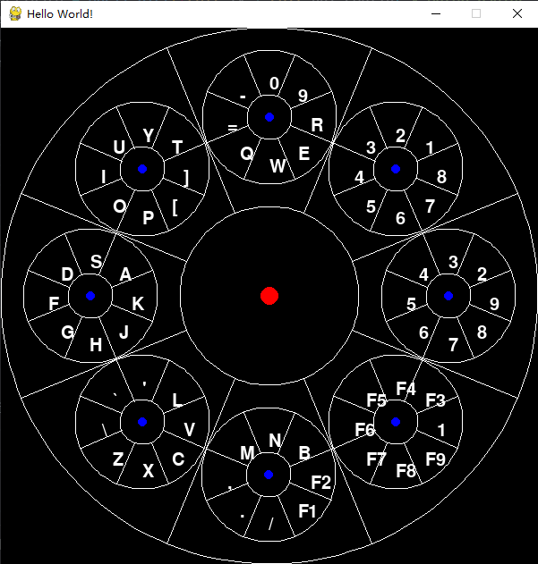
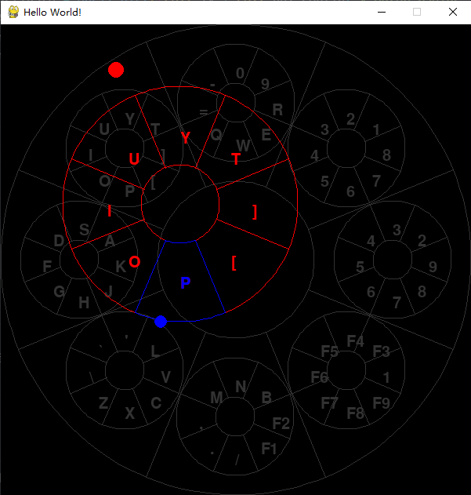

# 手柄输入法

使用手柄来代替键盘输入。（可以躺着在电脑上输入

主要使用手柄的两个摇杆来进行输入，八项的两个摇杆可以映射到键盘上的64个键。

手柄的两个扳机可以用来表示确认输入或者其他组合键（如Shift）。

结合手柄的其他按键可以做出键盘的效果。（主要用于组合键）

> 这当然是个半成品…主要是，谁会真的完全使用手柄来输入呢？

## 使用方法

```bash
pip install -r requirements.txt
python main.py
```



推动左右摇杆，选择合适的键盘。



按动右Trigger，输入内容。

## 问题

遇到的问题主要是在窗口未聚焦的情况下，如何监听手柄的输入。

我原本以为pygame会具备这个效果，但是后来发现并不具备。所以只能考虑直接跟手柄通信，我只有一个周末的时间，总不能为了一叠醋就真煮了饺子吧。

xinput.py 拷贝自 <https://github.com/r4dian/Xbox-Controller-for-Python>

但是这样的手柄输入相对于pygame获得的手柄输入看上去有些不灵敏。

## todo

1. 更合适的64键盘映射。
2. 适合手柄上其他按钮的组合键。
3. 更好的界面。（透明，而且换一些合适的配色。
4. 按下扳机确认输入后，振动反馈。
5. 一些配置界面。

